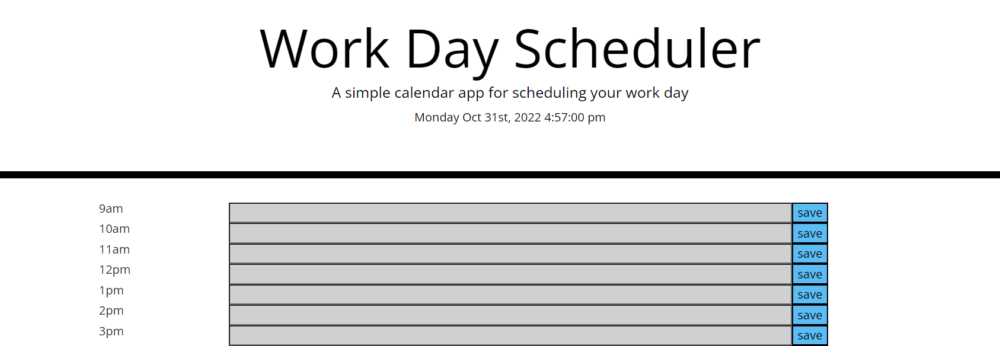

# Timothy-Assignment5---Work Day Scheduler

## Description
This is a project to show the working scheduler. You can type in the activities into the input row and save it. The current time will be shown in red color. The past time will be shown in grey color and the future time will be shown in green color.

## Screenshot

## Website Link
https://timo9939.github.io/Scheduler/

## Repository Link
https://github.com/timo9939/Scheduler